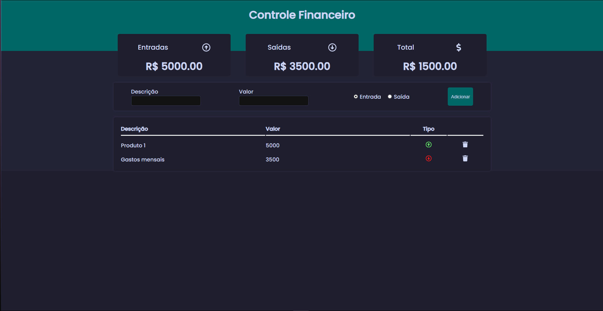

##Controle Financeiro
# Controle Financeiro



Um sistema para facilitar o gerenciamento de valores recebidos e gastos pelos usuários. Permite acompanhar e organizar suas finanças de forma simples e intuitiva.

## Tecnologias Usadas

- **React**: Para a criação da interface do usuário.
- **JavaScript**: Para lógica de programação e funcionalidades do sistema.

## Instalação

Siga os passos abaixo para instalar e rodar o projeto localmente.

1. Clone o repositório:
    ```bash
    https://github.com/NatHanNSilva12/controle-financeiro.git
    ```

2. Navegue até o diretório do projeto:
    ```bash
    cd controle-financeiro
    ```

3. Instale as dependências:
    ```bash
    npm install
    ```

4. Inicie o servidor de desenvolvimento:
    ```bash
    npm start
    ```

5. Acesse o aplicativo no navegador em `https://controle-financeiro-black.vercel.app`.

## Uso

1. Adicione suas receitas e despesas.
2. Visualize e gerencie seus valores recebidos e gastos através do painel de controle.

## Contribuição

Contribuições são bem-vindas! Siga os passos abaixo para contribuir com o projeto:

1. Faça um fork do repositório.
2. Crie uma branch para sua nova feature (`git checkout -b minha-feature`).
3. Faça commit das suas alterações (`git commit -am 'Adiciona nova feature'`).
4. Faça push para a branch (`git push origin minha-feature`).
5. Crie um Pull Request.

## Licença

Este projeto está licenciado sob a [MIT License](LICENSE).

---

Se você tiver alguma dúvida ou precisar de ajuda, sinta-se à vontade para abrir uma issue ou me contatar!


